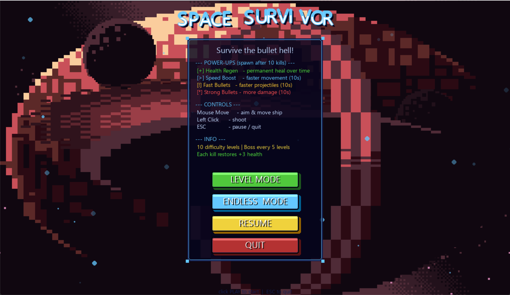
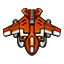
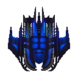
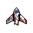

<p align="center">
  
</p>

# 🌌 Space Survivor
### *The Ultimate Roguelike Arcade Experience*

[](https://www.python.org/)
[](https://www.pygame.org/)
[](https://github.com/yourusername/space-survivor)
[](https://opensource.org/licenses/MIT)

**Space Survivor** is a high-octane, features-complete roguelike space shooter built from the ground up using Python and the Pygame library. It represents a professional approach to 2D game development, focusing on modularity, performance, and immersive "game feel."

---

## 📖 Table of Contents
1.  [Core Gameplay Pillars](#-core-gameplay-pillars)
2.  [The Roguelike Loop](#-the-roguelike-loop)
3.  [The Bestiary](#-the-bestiary)
4.  [Power-ups & Abilities](#-power-ups--abilities)
5.  [Technical Architecture](#-technical-architecture)
6.  [Project Structure](#-project-structure)
7.  [Installation & Setup](#-installation--setup)
8.  [Controls Guide](#-controls-guide)
9.  [Mobile & Touch Support](#-mobile--touch-support)
10. [FAQ](#-faq)
11. [Troubleshooting](#-troubleshooting)
12. [Contributing](#-contributing)

---

## 🚀 Core Gameplay Pillars

### 📈 Dynamic Difficulty Scaling (DDS)
Unlike standard shooters, Space Survivor's intensity is governed by a real-time difficulty engine. It monitors your performance metrics—including combat accuracy, survival time, and health-to-damage ratios—to adjust enemy spawn rates and stats.

### 🕹️ The Game Feel
We prioritize tactile feedback and visual "juice":
*   **Hit-Stop & Screen-Shake**: Frame-perfect hit-pauses and procedural shake for maximum impact.
*   **Cinematics**: Dynamic time-scaling and camera zoom during epic moments.
*   **VFX Particle Engine**: A custom particle system handling thousands of objects for explosions and engine trails.

---

## 🔄 The Roguelike Loop

### Mid-Run Progression
As you destroy enemies, you collect **XP Gems**. Filling your XP bar triggers a **Level Up**, letting you choose from randomized tactical upgrades:
*   **Offense**: Triple Shot, Homing Missiles, Chain Lightning (Bolt Power).
*   **Defense**: Energy Shields, Max Health Boosts, Health Regeneration.

---

## 👾 The Bestiary

| Enemy Type | Description | Sprite |
| :--- | :--- | :---: |
| **Normal Scout** | Reliable chasers that attempt to swarm the player. |  |
| **Shooter** | Marksmen that keep their distance while firing aimed projectiles. |  |
| **Vanguard Boss** | Massive command ships with multi-phase combat logic. |  |
| **The Player** | Your custom-fitted starfighter with health-reactive visuals. |  |

---

## 🏛️ Technical Architecture

### Event-Driven Design
The core engine uses an **Event Bus** to decouple gameplay logic from UI and SFX. When a player takes damage, the `Player` class emits an event that the `AudioManager`, `HUD`, and `VFXManager` handle independently.

### High-Performance Object Pooling
To maintain a consistent 60+ FPS, we use **Object Pooling** for all projectiles and particles. Instead of costly object instantiation during combat, the engine recycles inactive objects from a pre-allocated memory pool.

---

## 📁 Project Structure

```text
space-shooting/
├── assets/                 # All game resources
│   ├── audio/              # SFX and Music tracks
│   └── images/             # Sprites, Backgrounds, and UI
│       ├── background/     # Parallax layer assets
│       ├── bosses/         # Dreadnought sprites
│       ├── enemies/        # Standard enemy sprites
│       ├── player/         # Health-based player ships
│       └── readme/         # Visual documentation assets
├── src/                    # Core source code
│   ├── abilities/          # Dash, Ultimate, and Bomb logic
│   ├── audio/              # AudioManager implementation
│   ├── entities/           # Player, Enemies, Bullets, XP Gems
│   ├── lib/                # Shared utilities (Pools, Particles, Events)
│   └── screens/            # UI, Menu, Shop, and HUD overlays
└── main.py                 # Game entry point
```

---

## 🎮 Controls Guide

| Action | Key / Input | Touch / Mobile |
| :--- | :--- | :--- |
| **Movement** | `W`, `A`, `S`, `D` | Left Joystick |
| **Aiming** | `Mouse` | Automatic (Joystick Dir) |
| **Primary Fire** | `Left Click` | "FIRE" Button |
| **Dash** | `Space` | "DASH" Button |
| **Pause** | `P` / `ESC` | System Back / Menu |

---

## 🛠️ Installation & Setup

1.  **Requirements**: Python 3.10+ and Pygame 2.0+.
2.  **Clone the Repository**:
    ```bash
    git clone https://github.com/patelrudra0106-art/space-survivor.git
    cd space-survivor
    ```
3.  **Install Dependencies**:
    ```bash
    pip install pygame
    ```
4.  **Run the Game**:
    ```bash
    python main.py
    ```

---

## 📱 Mobile & Touch Support
The game is now fully playable on mobile and touch devices!
*   **Virtual Joystick**: 360-degree movement control on the left side of the screen.
*   **Tactical Buttons**: Dedicated on-screen buttons for Dash, Ultimate, and Shooting.
*   **Multi-Input**: Works seamlessly alongside Keyboard and Mouse controls.

---

## ❓ FAQ

**Q: Is there mobile/touch support?**
A: **Yes!** The game now features on-screen virtual controls. You can move with the joystick and use dedicated buttons for shooting and abilities.

---

## 🤝 Contributing
Contributions are what make the open-source community an amazing place to learn, inspire, and create. Any contributions you make are **greatly appreciated**.

---

<p align="center">
  <br>
  <i>Developed with authentic game assets and passion for performance.</i><br>
  <b>MIT License © 2026 Space Survivor</b>
</p>
